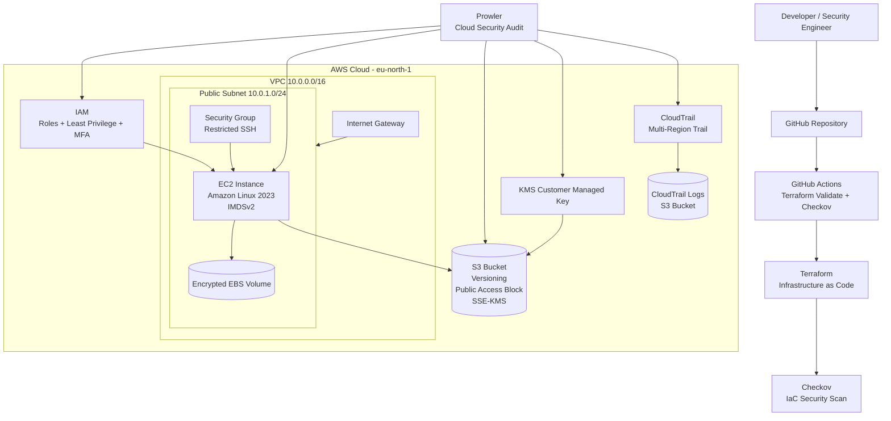

# AWS Cloud Security Posture Audit

## Project Overview

This project demonstrates a practical Cloud Security Posture Audit on AWS.

The objective was to build a small AWS environment, assess its security posture, identify misconfigurations, remediate important findings, and verify the improvements using automated security tools.

The project follows the methodology:

Finding → Risk → Remediation → Verification → Evidence

---

## Architecture

The lab includes:

- AWS VPC
- Public Subnet
- Internet Gateway
- Route Table
- Security Group
- EC2 Instance
- EBS Volume
- IAM Role
- S3 Bucket
- AWS KMS
- AWS CloudTrail
- Prowler
- Terraform
- Checkov
- GitHub Actions

---

## Security Controls Implemented

### EC2 and EBS

- Restricted SSH access to a trusted IP
- Disabled direct root SSH access
- Disabled password authentication
- Required SSH public key authentication
- Enabled IMDSv2
- Enabled EBS encryption by default
- Migrated the EC2 root volume to an encrypted EBS volume
- Enabled automatic KMS key rotation

### IAM

- Implemented least-privilege access
- Used an IAM role for EC2 instead of permanent AWS access keys
- Removed long-lived IAM user credentials
- Enabled MFA for the AWS root account

### S3

- Enabled bucket-level Public Access Block
- Enabled account-level S3 Public Access Block
- Enabled versioning
- Enforced HTTPS-only access
- Enabled SSE-KMS encryption
- Used a customer-managed KMS key

### Logging and Audit

- Reviewed AWS API activity using CloudTrail Event History
- Created a permanent multi-region CloudTrail trail
- Stored CloudTrail logs in a dedicated S3 bucket
- Verified CloudTrail log delivery and inspected raw JSON events

---

## Prowler Security Audit

Prowler was used as a Cloud Security Posture Management tool to automatically audit the AWS environment.

Initial EC2 scan:

- 78 checks executed
- 51 passed
- 16 failed

Important findings included:

- EBS encryption disabled
- IMDSv2 not required at account level
- Public EC2 exposure
- Missing EBS snapshots
- Network ACL findings

A global AWS scan was later performed and the findings were triaged based on:

- Security impact
- Relevance to the lab
- Cost
- Production applicability

Not every finding was remediated.

Some controls were classified as:

- Remediated
- Accepted Risk
- Not Applicable

---

## Key Findings and Remediations

### EBS Encryption

Before:

- EC2 root volume was not encrypted
- Default EBS encryption was disabled

Remediation:

- Enabled EBS encryption by default
- Created a snapshot of the existing volume
- Created an encrypted copy
- Created a new encrypted volume
- Replaced the EC2 root volume

Verification:

Prowler result: PASS

---

### IMDSv2

Finding:

IMDSv2 was not enforced by default at account level.

Remediation:

Configured EC2 metadata defaults to require IMDSv2.

Verification:

Prowler result: PASS

---

### S3 Public Access

Finding:

Account-level S3 Public Access Block was not configured.

Remediation:

Enabled:

- BlockPublicAcls
- IgnorePublicAcls
- BlockPublicPolicy
- RestrictPublicBuckets

Verification:

Prowler result: PASS

---

### S3 Encryption

Before:

S3 used SSE-S3 encryption.

Remediation:

Created a customer-managed AWS KMS key and configured the bucket to use SSE-KMS.

Verification:

Prowler result: PASS

---

### IAM Long-Lived Credentials

Finding:

An IAM user had an active long-lived access key.

Remediation:

- Disabled the key
- Verified its status
- Deleted the key

Verification:

Prowler result: PASS

---

### Root MFA

Before:

Root MFA was not enabled.

Remediation:

Configured MFA for the AWS root account.

Verification:

AccountMFAEnabled = 1

---

## Terraform and Checkov

A small Terraform configuration was created to demonstrate Infrastructure as Code security.

The initial Terraform configuration intentionally contained security weaknesses.

Initial Checkov scan:

- 8 passed
- 11 failed

Detected issues included:

- SSH open to 0.0.0.0/0
- Missing S3 Public Access Block
- Missing S3 versioning
- Missing KMS encryption
- Overly permissive outbound traffic

After remediation:

- 18 passed
- 5 failed

The remaining findings were classified as outside the scope of the lab or accepted risks.

This demonstrates Shift-Left Security:

Terraform Code
→ Checkov Scan
→ Security Findings
→ Remediation
→ Secure Code

---

## CI/CD Security Pipeline

GitHub Actions was configured to automatically validate and scan Terraform code.

Pipeline:

Developer
→ Git Push
→ GitHub Actions
→ Terraform Format Check
→ Terraform Init
→ Terraform Validate
→ Checkov Security Scan
→ PASS / FAIL

The first pipeline failed because Checkov detected security findings.

After remediation and documented exceptions, the pipeline passed successfully.

This demonstrates the use of a security gate before infrastructure deployment.

---

## Technologies

- AWS EC2
- AWS VPC
- AWS IAM
- Amazon S3
- AWS KMS
- AWS CloudTrail
- Amazon EBS
- Linux
- AWS CLI
- Prowler
- Terraform
- Checkov
- Git
- GitHub
- GitHub Actions

---

## Lessons Learned

This project provided practical experience with:

- AWS security hardening
- IAM least privilege
- Cloud security posture management
- Encryption at rest
- AWS KMS
- Cloud audit logging
- Security findings triage
- Infrastructure as Code
- Shift-left security
- CI/CD security gates
- Risk acceptance and remediation
